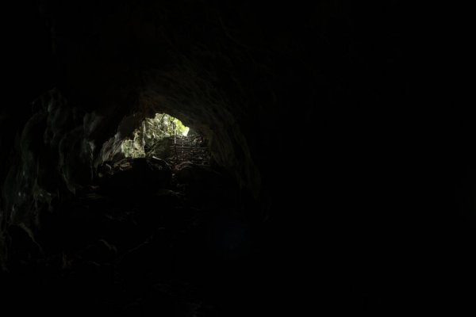

## **Processamento Digital de Imagens**
Resolução das Atividades Práticas 
Segunda Unidade 
Manoel Benedito Neto 

### Questão 07
* **Enunciado** 
Utilizando o programa exemplos/dft.cpp como referência, implemente o filtro homomórfico para melhorar imagens com iluminação irregular. Crie uma cena mal iluminada e ajuste os parâmetros do filtro homomórfico para corrigir a iluminação da melhor forma possível. Assuma que a imagem fornecida é em tons de cinza.

 

|  |
| :--: |
| *Imagem utilizada no processo de Solução* |

### Questão 09
* **Enunciado** 
Utilizando o programa kmeans.cpp como exemplo prepare um programa exemplo onde a execução do código se dê usando o parâmetro nRodadas=1 e inciar os centros de forma aleatória usando o parâmetro KMEANS_RANDOM_CENTERS ao invés de KMEANS_PP_CENTERS. Realize 10 rodadas diferentes do algoritmo e compare as imagens produzidas. Explique porque elas podem diferir tanto.

 

|  |
| :--: |
| *Imagem utilizada no processo de Solução* |

### **Observações**
Respostas nos comentários do código respectivo a questão.